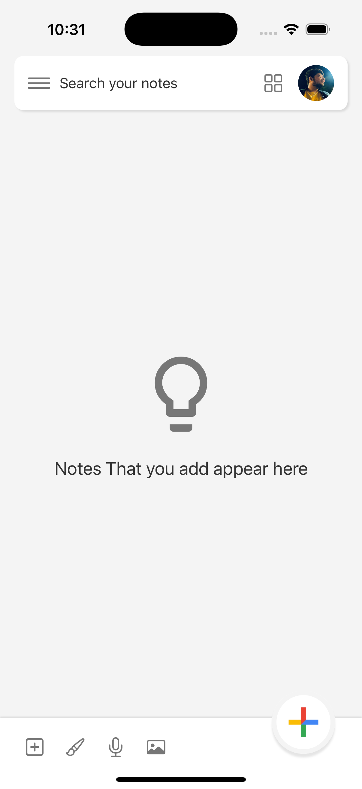

# FundoNotes - React Native

A feature-rich Google Keep clone built with React Native, implementing various navigations, note-taking functionalities, Firebase authentication, and additional utilities like dark mode and feedback.

## Features

### Navigation
- **Custom Drawer Navigation** for seamless access to different sections.
- **Stack Navigation** for smooth screen transitions.

### Note Management
- **Create Notes** with various formats:
    - Plain Text
    - List Items
    - Drawings (Sketch)
    - Images
- **Add Reminders** to notes for task management.
- **Archive Notes** to store important notes separately.
- **Delete Notes** with a bin/trash section for recovery.
- **Pin Notes** for quick access to important notes.
- **Search Notes** functionality to find notes easily.
- **Label Notes** for better organization.

### Additional Features
- **Dark Mode** for a better user experience in low-light environments.
- **Feedback System** allowing users to share their experience.
- **Drag & Drop Notes** to rearrange them easily.
- **Cloud Sync** using Firebase to keep notes updated across devices.
- **Authentication System** using Firebase for secure login and user management.

## Technologies Used
- **React Native** for building the mobile application.
- **Firebase** for authentication and real-time database:
    - Firestore for storing notes and user data.
    - Firebase Authentication for user login and signup.
    - Firebase Cloud Storage for storing images and drawings.
- **React Navigation** for handling multiple screens.
- **Context API / Redux** (if used) for state management.
- **AsyncStorage** for caching data locally.

## Installation & Setup

1. Clone the repository:
   ```sh
   git clone https://github.com/samarthmistrySM/FundoNotes.git
   cd FundoNotes
   ```

2. Install dependencies:
   ```sh
   npm install
   # or
   yarn install
   ```

3. Set up Firebase:
    - Create a Firebase project in the [Firebase Console](https://console.firebase.google.com/).
    - Enable Firestore Database and Firebase Authentication.
    - Obtain your `GoogleService-Info.plist` (for iOS) files and place them in the appropriate directories.
    - Configure Firebase in your project.

4. Run the application:
   ```sh
   npx run ios       # For iOS (Mac only)
   ```

## Screenshots

### Authentication
<table>
  <tr>
    <td></td>
    <td></td>
  </tr>
</table>

### Home Screen
<table>
  <tr>
    <td></td>
    <td></td>
    <td></td>
    <td></td>
  </tr>
</table>

### Custom Drawer
<table>
  <tr>
    <td></td>
    <td></td>
  </tr>
</table>

### Set Reminder
<table>
  <tr>
    <td></td>
  </tr>
</table>

### Dark Mode
<table>
  <tr>
    <td></td>
    <td></td>
  </tr>
</table>


## Future Enhancements
- **Collaborative Notes** for multiple users to edit together.
- **Voice Notes** support for adding voice recordings.
- **Widgets** for quick note access.
